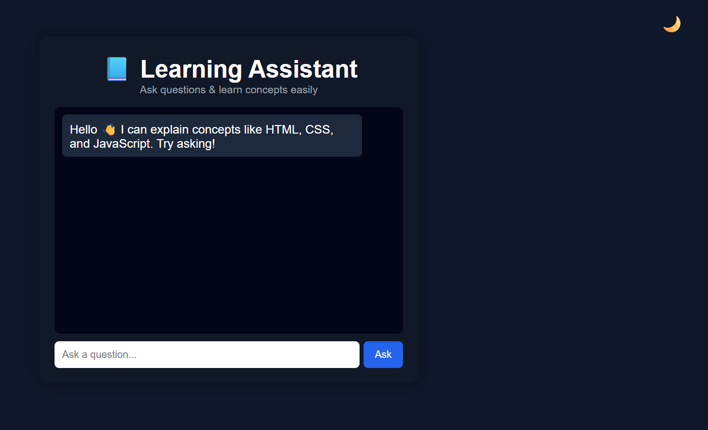
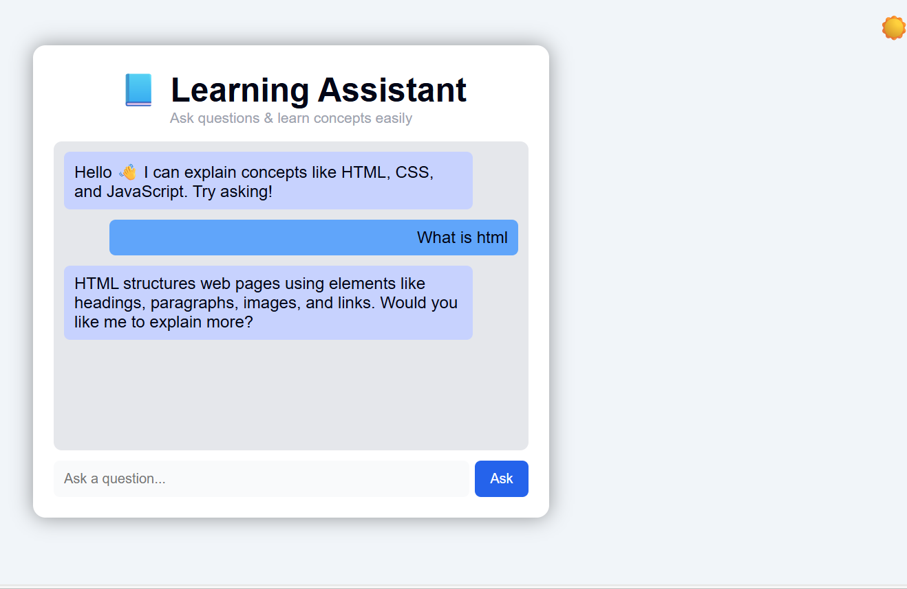

# learning-assistant
Learning Assistant App - A responsive web application built with HTML, CSS, and JavaScript that explains concepts, answers questions, and supports dark/light mode with saved user preferences.

## 📸 Screenshots

### 🌞 Dashboard - Light Mode

### 🌙 Dashboard - Dark Mode

### 🔐 Console output

